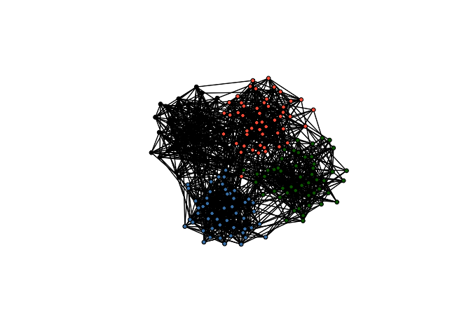
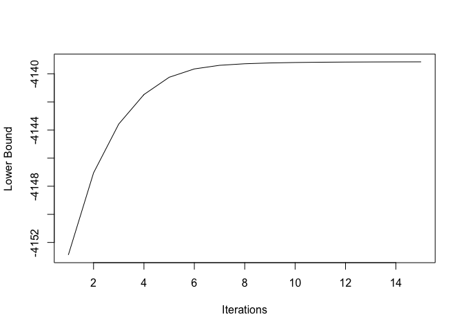
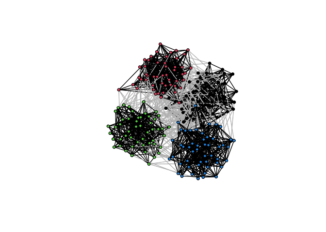
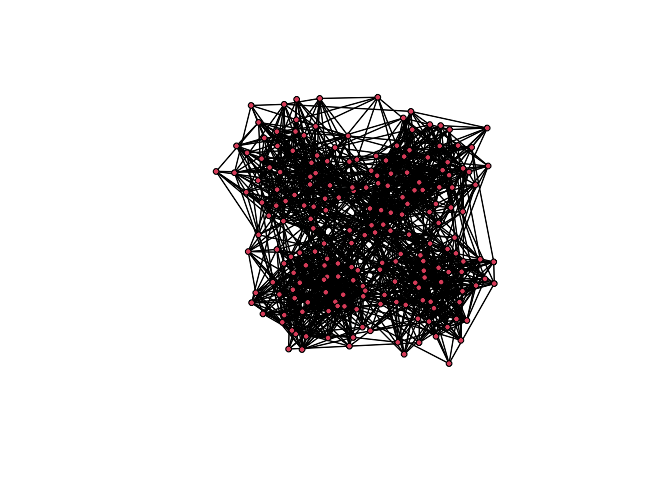
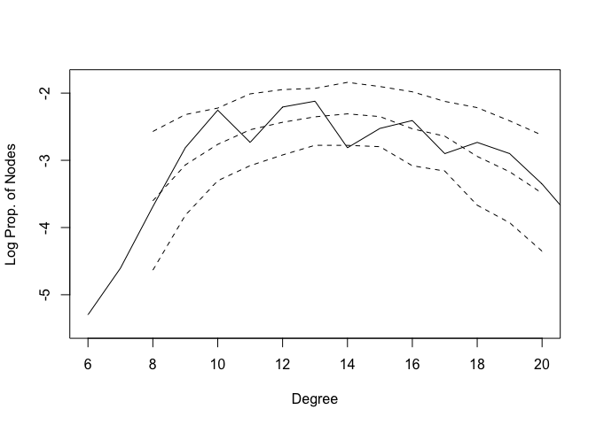
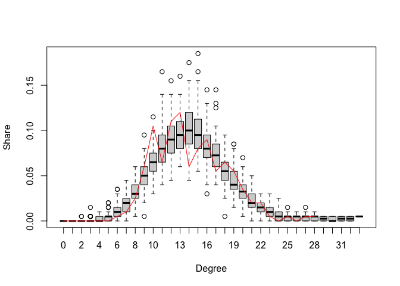
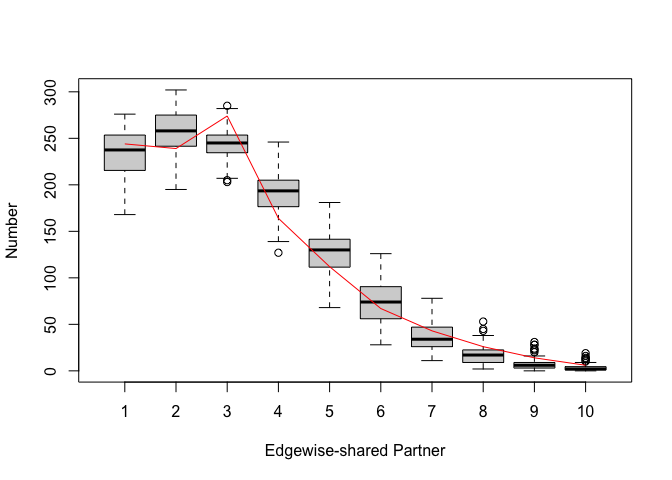
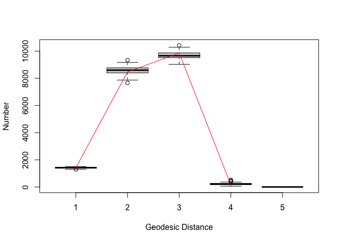
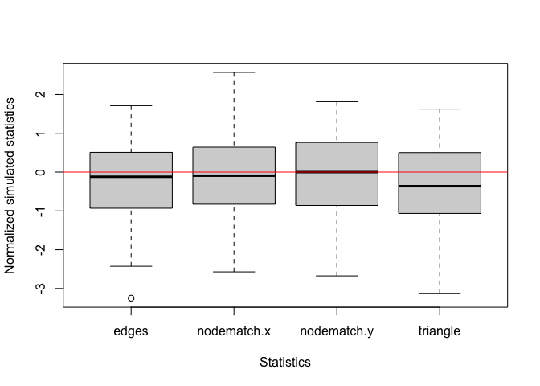

# `bigergm`: Estimating Exponential-Family Random Graph Models for Large Networks

This vignette provides a brief introduction on how to use the R package
`bigergm`, which estimates Hierarchical Exponential-Family Random Graph
Models (HERGMs, Schweinberger and Handcock 2015). `bigergm` is built
upon the R packages `lighthergm`(Martínez Dahbura et al. 2021) and
`hergm` (Schweinberger and Luna 2018) and applies scalable algorithms
and computational techniques. See Martínez Dahbura et al. (2021) and
Fritz et al. (2024) for further information on the implementation
enhancements for undirected and directed networks, respectively. In this
vignette, we will focus on undirected networks.

Exponential Random Graph Models (ERGMs) are a popular class of models
for network data. They model the probability of observing a network as a
function of network statistics, such as the number of edges and
triangles. ERGMs are commonly employed in social network analysis but
have some limitations when applied to large networks. The main
limitation is that the likelihood function is intractable for large
networks, making it difficult to estimate the model parameters. At the
same time, larger networks warrant more complex models to capture the
underlying structure of the network.

To address these limitations, `bigergm` implements a scalable algorithm
for estimating HERGMs, which generalize ERGMs that allow for local
dependence induced by non-overlapping blocks of nodes with network data.
Introduced by Schweinberger and Handcock (2015), dependence is allowed
only between nodes within the same block. This allows for a more
flexible model that can capture the cohesive subgroups in the network
globally while accounting for dependence within these subgroups on the
local level.

# Installation

You can install the CRAN version of `bigergm` by running the following
command:

``` r
install.packages("bigergm")
```

# A simple example

Let’s start with a simple example using the toy network included in the
package. The toy network is a small network with a clear community
structure, which is useful for testing the package.

``` r
# Load an embedded network object.
data(toyNet)
# Draw the network.
plot(toyNet, vertex.col = rep(c("tomato", "steelblue", "darkgreen", "black"),
                        each = toyNet$gal$n/4))
```



It is clearly visible that this network has a cluster or community
structure. Although this is an artificial network, we often observe such
community structures in real social networks. Exploiting this stylized
fact, we model the way population members in a network get connected
differently for connections across and within communities:

- Connections across communities happen by luck, influenced by homophily
- Connections within communities also consider interdependencies among
  links. For example, the probability that agent $i$ and $j$ gets
  connected may be influenced by a friend in common $k$.

We can estimate the model using the `bigergm::bigergm()` function, which
estimates the model in two steps: first, it recovers the latent
community structure, and then it estimates the model parameters. The
parameter “object” specifies a formula for the model to estimate (this
is the same as in `ergm::ergm()`). If the parameter
“clustering_with_features” is set to TRUE, the algorithm takes into
account nodematch on characteristics when clustering. Also, the effects
for the between block networks are assumed to be all terms from the
provided formula that do not induce any dependence. The effects for the
within block networks are assumed to be all terms from the provided
formula. The parameter “n_clusters” specifies the number of blocks to
recover. The parameter “n_MM_step_max” specifies the maximum number of
MM algorithm steps. The parameter “tol_MM_step” details when convergence
is reached. In particular, the algorithm stops when the relative change
in the lower bound of the objective function is less than “tol_MM_step”.
The parameter “estimate_parameters” specifies whether to estimate the
parameters after the block recovery step. The parameter
“check_block_membership” specifies whether to keep track of block
memberships at each EM iteration. There are other parameters that you
can specify, which are detailed in the documentation (see
`help(bigergm)`).

``` r
model_formula <- toyNet ~ edges + nodematch("x") + nodematch("y") + triangle

bigergm_res <-bigergm(
    # The model you would like to estimate
    object = model_formula,
    # The number of blocks
    n_clusters = 4,
    # The maximum number of MM algorithm steps
    n_MM_step_max = 100,
    # The tolarence for the MM algorithm
    tol_MM_step = 1e-6,
    # Perform parameter estimation after the block recovery step
    estimate_parameters = TRUE,
    # Indicate that clustering must take into account nodematch on characteristics
    clustering_with_features = TRUE,
    # Keep track of block memberships at each EM iteration
    check_block_membership = TRUE
)
```

To see whether the first step (recovering the latent community
structure) has converged, we can plot the estimated lower bound of the
objective function over iterations.

``` r
plot(1:length(bigergm_res$MM_lower_bound),
     bigergm_res$MM_lower_bound, type = "l", xlab = "Iterations", ylab = "Lower Bound")
```



This indicates that the clustering step converged at the early stage.
Note that the number of iterations that you need to perform
(`n_MM_step_max`) varies depending on the size of a network, whether it
has a clear community structure, etc.. You need trial and error on how
many iterations are at least necessary in your case. Plotting the lower
bound may help check the convergence of the clustering step.

You can check the clustering result by plotting the network with nodes
colored by the estimated block membership. The colour of the edges is
grey if the two population members are from different blocks and black
otherwise.

``` r
plot(bigergm_res)
```



and estimated parameters.

``` r
# For the between networks
summary(bigergm_res$est_between)
#>  Results:
#> 
#>             Estimate Std. Error MCMC % z value Pr(>|z|)    
#> edges       -4.21749    0.07482      0 -56.369   <1e-04 ***
#> nodematch.x  0.78273    0.16144      0   4.848   <1e-04 ***
#> nodematch.y  0.38854    0.18433      0   2.108    0.035 *  
#> ---
#> Signif. codes:  0 '***' 0.001 '**' 0.01 '*' 0.05 '.' 0.1 ' ' 1
#> 
#> Warning:  The standard errors are based on naive pseudolikelihood and are suspect. Set control.ergm$MPLE.covariance.method='Godambe' for a simulation-based approximation of the standard errors.
#> 
#>      Null Pseudo-deviance: 2576  on 8  degrees of freedom
#>  Residual Pseudo-deviance: 2551  on 5  degrees of freedom
#>  
#> AIC: 2557  BIC: 2558  (Smaller is better. MC Std. Err. = NA)
```

``` r
# For the within networks
summary(bigergm_res$est_within)
#> Call:
#> ergm::ergm(formula = within_formula, estimate = method, control = control)
#> 
#> Maximum Pseudolikelihood Results:
#> 
#>             Estimate Std. Error MCMC % z value Pr(>|z|)    
#> edges       -1.80056    0.06660      0 -27.036   <1e-04 ***
#> nodematch.x  0.86683    0.10351      0   8.375   <1e-04 ***
#> nodematch.y  0.96478    0.10368      0   9.305   <1e-04 ***
#> triangle     0.14615    0.01744      0   8.382   <1e-04 ***
#> ---
#> Signif. codes:  0 '***' 0.001 '**' 0.01 '*' 0.05 '.' 0.1 ' ' 1
#> 
#> Warning:  The standard errors are based on naive pseudolikelihood and are suspect. Set control.ergm$MPLE.covariance.method='Godambe' for a simulation-based approximation of the standard errors.
#> 
#>      Null Pseudo-deviance: 6793  on 4900  degrees of freedom
#>  Residual Pseudo-deviance: 5154  on 4896  degrees of freedom
#>  
#> AIC: 5162  BIC: 5188  (Smaller is better. MC Std. Err. = 0)
```

Currently, the only supported way to include covariates in the model is
via `nodematch()`.

You can also employ caching to avoid repeating heavy operations that
yield the same results for your network. To use it, pass the `cache`
parameter to `bigergm::bigergm`, setting its value to a
[cachem](https://github.com/r-lib/cachem "cachem repository") object. A
disk cache lets you speed up estimations on the same network data even
across R Sessions.

# Simulation

You can simulate networks with local dependence using the function
`bigergm::simulate_bigergm()`. The function requires the estimated
coefficients for the between and within connections, the formula for the
model, the data frame containing the nodes attributes, the name of the
column containing the node IDs, the name of the column containing the
block IDs, the MCMC settings, the number of simulations to return, and
the output format. Depending on the output format, the function returns
a list with the network statistics for the between and within
connections, the adjacency matrix of the simulated network, or the
network object itself.

``` r
# Estimated coefficients for the between-community connections
coef_between_block <- coef(bigergm_res$est_between)

# Estimated coefficients for the within-community connections
coef_within_block <- coef(bigergm_res$est_within)


# The MCMC settings
sim_ergm_control <- ergm::control.simulate.formula(
  MCMC.burnin = 1000000,
  MCMC.interval = 100000
)
sim_net <- bigergm::simulate_bigergm(
  formula = model_formula,
  # The coefficients for the between connections
  coef_between = coef_between_block,
   # The coefficients for the within connections
  coef_within = coef_within_block,
  # The MCMC settings
  control_within = sim_ergm_control,
  # Number of simulations to return
  n_sim = 1,
  # If `stats` a list with network statistics 
  # for the between and within connections is returned
  output = "network"
)
```

After simulating the network, you can plot it to check whether the
community structure is preserved.

``` r
plot(sim_net)
```



# Goodness-of-fit

Following the estimation, you may want to evaluate the goodness-of-fit
of the model. In line with the ERGM literature, we provide a
goodness-of-fit test that evaluates the model’s fit to the observed
network. In the package, we provide a function to carry out this task:

``` r
gof_res <- gof(
  # The object returned by bigergm::bigergm()
  object = bigergm_res,
  # The MCMC settings
  control_within = sim_ergm_control,
  # The number of simulations to use
  n_sim = 100, 
  # Compute the geodesic distance for the observed and each simulated network
  compute_geodesic_distance = TRUE,
  # Start at the observed network
  start_from_observed = TRUE
)
```

The procedure evaluates the following metrics:

1.  network statistics (the counts you obtain when you use summary on an
    ergm formula, such as the number of edges, triangles, nodematches,
    etc.),

2.  normalized network statistics (the network statistics normalized
    around the observed statistics),

3.  degree distribution,

4.  geodesic distance, and

5.  edgewise shared partners.

`bigergm::gof_bigergm()` returns a list of data frames for these
matrices instead of creating plots as `ergm::gof()` does. This allows
you to flexibly create plots that match your needs. Below is a example
plot for the degree distribution on the log scale.

``` r
degree_gof <- 
  gof_res$simulated$degree_dist %>%
  dplyr::group_by(degree) %>%
  dplyr::summarise(log_mean_share = mean(log(share)),
                   log_sd_share = sd(log(share))) %>%
  dplyr::ungroup()
plot(degree_gof$degree, degree_gof$log_mean_share,
     xlab = "Degree", ylab = "Log Prop. of Nodes",
     ylim = c(-5.5,-1.8), xlim = c(6,20), type = "l", lty = 2)
lines(degree_gof$degree, degree_gof$log_mean_share+ 1.96 * degree_gof$log_sd_share, type = "l", lty = 2)
lines(degree_gof$degree, degree_gof$log_mean_share- 1.96 * degree_gof$log_sd_share, type = "l", lty = 2)
tmp_info <- gof_res$original$degree_dist %>% 
  dplyr::filter(share > 0 & degree < 22)
lines(tmp_info$degree, log(tmp_info$share), lty = 1)
```



Alternatively, you can use the `plot()` function to visualize the
goodness-of-fit results. Three plots are generated checking whether the
estimated model can adequately capture the degree distribution,
edgewise-shared partner distribution, geodesic distances of the observed
network. In the fourth plot the simulated network statistics normalized
around the observed statistics are ploted. For a good fit, all values
should be around zero. In all plots, the red line represents the
observed network, and the boxplot represents the simulated networks.

``` r
plot(gof_res)
```



# When you work with large networks

If you would like to estimate an bigergm with a large network (say, when
the number of nodes $\geq$ 50,000):

- Select features sparse enough to fit into memory. Covariates such as
  gender or race will be too dense to construct feature matrices. This
  is a non-negligible limitation of our algorithm and will be solved in
  the future.
- Prepare a list of multiplied feature adjacency matrices by
  `bigergm::compute_multiplied_feature_matrices()`, and pass it to
  `bigergm::bigergm()` by `list_multiplied_feature_matrices`. Once
  calculated and stored, it can be used in models with the same network
  and the same features.
- Use Python’s infomap to initialize clusters. This is because it is
  much faster to implement cluster initialization than R functions such
  as `igraph::cluster_infomap()`. To install it, run
  `system("pip3 install infomap")` and check if it is effective by
  `system("infomap --version")`. If `system("infomap --version")` yields
  an error, consider using `{reticulate}`.
- If successfully installed Python’s infomap, set
  `use_infomap_python = TRUE` in `bigergm::bigergm()`.
- When the MM estimation does not seem to have converged by inspecting
  the lower bound plot, you can further continue iterating by passing
  the `bigergm` class object to `bigergm::bigergm()` as follows (all
  parameters such as the number of MM iterations will be inherited from
  the previous estimation unless specified).

``` r
bigergm_res_second <-
  bigergm::bigergm(object = bigergm_res)
```

# References

<div id="refs" class="references csl-bib-body hanging-indent"
entry-spacing="0">

<div id="ref-fritz2024" class="csl-entry">

Fritz, Cornelius, Co-Piere Georg, Angelo Mele, and Michael
Schweinberger. 2024. “A Strategic Model of Software Dependency
Networks,” Working Paper. Available at https://arxiv.org/abs/2402.13375.

</div>

<div id="ref-martinezdahbura2021" class="csl-entry">

Martínez Dahbura, Juan Nelson, Shota Komatsu, Takanori Nishida, and
Angelo Mele. 2021. “A Structural Model of Business Card Exchange
Networks,” Working Paper. Available at https://arxiv.org/abs/2105.12704.

</div>

<div id="ref-schweinberger2015" class="csl-entry">

Schweinberger, Michael, and Mark S Handcock. 2015. “Local Dependence in
Random Graph Models: Characterization, Properties and Statistical
Inference.” *Journal of the Royal Statistical Society B* 77 (3): 647–76.

</div>

<div id="ref-schweinberger2018" class="csl-entry">

Schweinberger, Michael, and Pamela Luna. 2018. “Hergm: Hierarchical
Exponential-Family Random Graph Models.” *Journal of Statistical
Software* 85 (1): 1–39.

</div>

</div>
